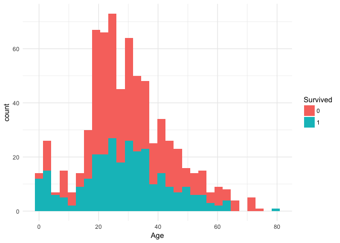
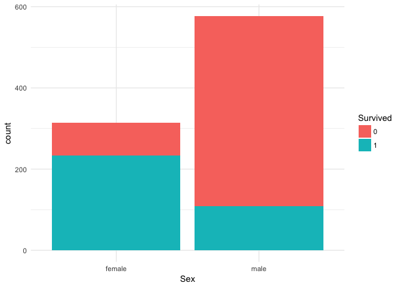
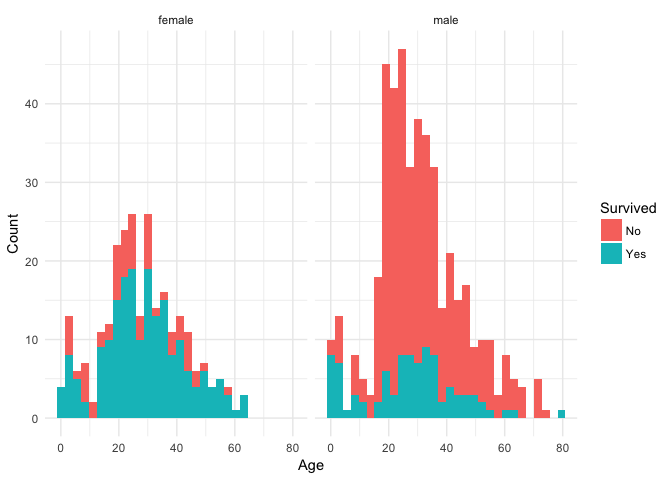

Titanic Data
================
Ramon Mata

This notebook contains the exploratory analysis and modeling for the *Titanic Getting Started Prediction Competition*, it also tries to document **R** commands executed

*Update Date: Wed May 3 14:16:32 2017* <br> *R version: 3.4.0*

Packages and Data Files
-----------------------

The following commands add the specified variables to the R environment so we can use their functionality

``` r
# Data Visualisation and themes
library('ggplot2')
library('ggthemes')

# Scale functions for Visualisations
library('scales')

# Data Manipulation
suppressMessages(library('dplyr'))

# Classification and Regression with Random Forest
suppressMessages(library('randomForest'))
```

The supressMessage function will *"suppress"* the extra information printed by the later 2 packages.

Write `?supressMessages` in the R console to get help

Loading Data
------------

``` r
# Load train and test files provided by Kaggle and
# not reading string as Factors
train <- read.csv('data/train.csv', stringsAsFactors = FALSE)
test <- read.csv('data/test.csv', stringsAsFactors = FALSE)
```

-   See [Factors](https://stat.ethz.ch/R-manual/R-devel/library/base/html/factor.html)
-   `?factor` in the R console for help

After Data is loaded in R Global Environment, we can take a quick look at the data by executing the following:

``` r
str(train)
```

    ## 'data.frame':    891 obs. of  12 variables:
    ##  $ PassengerId: int  1 2 3 4 5 6 7 8 9 10 ...
    ##  $ Survived   : int  0 1 1 1 0 0 0 0 1 1 ...
    ##  $ Pclass     : int  3 1 3 1 3 3 1 3 3 2 ...
    ##  $ Name       : chr  "Braund, Mr. Owen Harris" "Cumings, Mrs. John Bradley (Florence Briggs Thayer)" "Heikkinen, Miss. Laina" "Futrelle, Mrs. Jacques Heath (Lily May Peel)" ...
    ##  $ Sex        : chr  "male" "female" "female" "female" ...
    ##  $ Age        : num  22 38 26 35 35 NA 54 2 27 14 ...
    ##  $ SibSp      : int  1 1 0 1 0 0 0 3 0 1 ...
    ##  $ Parch      : int  0 0 0 0 0 0 0 1 2 0 ...
    ##  $ Ticket     : chr  "A/5 21171" "PC 17599" "STON/O2. 3101282" "113803" ...
    ##  $ Fare       : num  7.25 71.28 7.92 53.1 8.05 ...
    ##  $ Cabin      : chr  "" "C85" "" "C123" ...
    ##  $ Embarked   : chr  "S" "C" "S" "S" ...

``` r
str(test)
```

    ## 'data.frame':    418 obs. of  11 variables:
    ##  $ PassengerId: int  892 893 894 895 896 897 898 899 900 901 ...
    ##  $ Pclass     : int  3 3 2 3 3 3 3 2 3 3 ...
    ##  $ Name       : chr  "Kelly, Mr. James" "Wilkes, Mrs. James (Ellen Needs)" "Myles, Mr. Thomas Francis" "Wirz, Mr. Albert" ...
    ##  $ Sex        : chr  "male" "female" "male" "male" ...
    ##  $ Age        : num  34.5 47 62 27 22 14 30 26 18 21 ...
    ##  $ SibSp      : int  0 1 0 0 1 0 0 1 0 2 ...
    ##  $ Parch      : int  0 0 0 0 1 0 0 1 0 0 ...
    ##  $ Ticket     : chr  "330911" "363272" "240276" "315154" ...
    ##  $ Fare       : num  7.83 7 9.69 8.66 12.29 ...
    ##  $ Cabin      : chr  "" "" "" "" ...
    ##  $ Embarked   : chr  "Q" "S" "Q" "S" ...

Thigs we notice after the execution of `str()` for both data files

-   We have an extra variable `Survived` in train file
-   Age contains `NA`
-   Cabin may come as empty string <?@%7C>@

Exploratory Analysis
--------------------

### Age vs Survived

``` r
ggplot(train, aes(Age, fill = factor(Survived))) +
  geom_histogram(bins=30) +
  theme_minimal() +
  xlab("Age") +
  scale_fill_discrete(name = "Survived")
```

    ## Warning: Removed 177 rows containing non-finite values (stat_bin).

 \#\#\# Sex vs Survived

``` r
ggplot(train, aes(Sex, fill = factor(Survived))) +
  geom_histogram(stat = "count") +
  theme_minimal() +
  xlab("Sex") +
  scale_fill_discrete(name = "Survived")
```

    ## Warning: Ignoring unknown parameters: binwidth, bins, pad



### Age vs Sex vs Survived

``` r
ggplot(train, aes(Age, fill = factor(Survived))) +
  geom_histogram(bins=30) +
  theme_minimal() +
  xlab("Age") +
  ylab("Count") +
  facet_grid(.~Sex)+
  scale_fill_discrete(name = "Survived")
```

    ## Warning: Removed 177 rows containing non-finite values (stat_bin).



Data Processing and Exploratory Analysis
----------------------------------------

Modeling with Random Forest
---------------------------

Cross - Validation ?
--------------------

Prediction
----------
